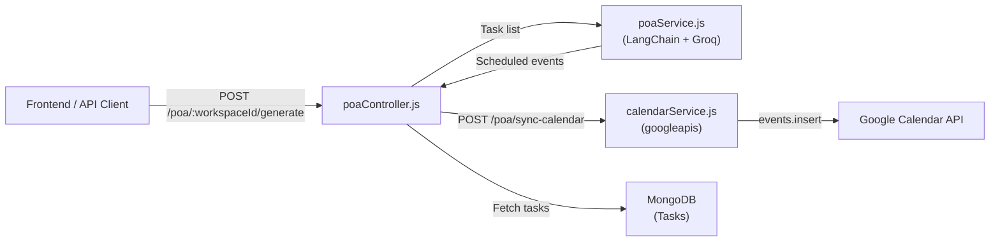

# POA (Plan of Action) Calendar Sync Module

## Reference Repositorys

[Choose-Your-Own-Adventure](https://github.com/Nishtha-8104/Choose-Your-Own-Adventure/tree/main) -- Python/FastAPI app using LangChain + Groq. We are translating its core patterns to Node.js/Express.

Key patterns borrowed from reference:

- `ChatGroq` with `llama-3.3-70b-versatile` (free Groq API) -- reference uses `langchain_groq.ChatGroq`
- `PydanticOutputParser` pattern -- we translate this to `StructuredOutputParser` with Zod in Node.js
- `ChatPromptTemplate.from_messages` with `.partial(format_instructions=...)` -- same pattern in JS
- Chain: `prompt -> LLM -> parser` (LCEL pipe)

## Architecture Overview



## Key Decisions

- **LLM**: Groq (`llama-3.3-70b-versatile`) via `@langchain/groq` -- completely free, extremely fast inference. Same as reference repo.
- **Calendar Auth**: Google Service Account (server-to-server, no user consent flow needed)
- **Time lib**: `date-fns` for ISO8601 formatting of `current_time` passed to the prompt
- **Output parsing**: LangChain `StructuredOutputParser` with Zod schema (Node.js equivalent of reference's `PydanticOutputParser`)

## Edge Case: Old Low-Priority Tasks

The prompt will include each task's `createdAt` timestamp and an explicit instruction:

> "If a task has low priority but was created a long time ago (more than 3 days), treat it as medium priority. If older than 7 days, treat it as high priority."

This requires the Task model to have timestamps -- currently it does not.

## Files to Create

### 1. [Backend/services/poaService.js](Backend/services/poaService.js) (new)

LangChain LCEL chain, mirroring the reference's `core/story_generator.py` pattern:

- `ChatGroq` model with `llama-3.3-70b-versatile` (like reference's `cls._get_llm()`)
- `StructuredOutputParser.fromZodSchema(poaSchema)` (like reference's `PydanticOutputParser(pydantic_object=StoryLLMResponse)`)
- `ChatPromptTemplate.fromMessages(...)` with `.partial({ format_instructions })` (same pattern as reference)
- Chain: `prompt.pipe(llm).pipe(parser)` (LCEL equivalent of reference's `llm.invoke(prompt.invoke({}))` then `parser.parse()`)
- Exported function: `generatePOA(tasks)` -- accepts task array, returns scheduled event array

```javascript
// Mirrors reference's StoryGenerator.generate_story pattern
const { ChatGroq } = require("@langchain/groq");
const { ChatPromptTemplate } = require("@langchain/core/prompts");
const { StructuredOutputParser } = require("langchain/output_parsers");

const llm = new ChatGroq({ model: "llama-3.3-70b-versatile" });
const parser = StructuredOutputParser.fromZodSchema(poaSchema);
const prompt = ChatPromptTemplate.fromMessages([
  ["system", POA_PROMPT],
  ["human", "Here are the tasks to schedule:\n{tasks}"],
]).partial({ format_instructions: parser.getFormatInstructions() });

const chain = prompt.pipe(llm).pipe(parser);
```

### 2. [Backend/services/calendarService.js](Backend/services/calendarService.js) (new)

Google Calendar integration:

- Authenticates via Service Account JSON key file (path from `GOOGLE_SERVICE_ACCOUNT_KEY_PATH` env var)
- Exported function: `syncToCalendar(events, calendarId)` -- loops through events, calls `calendar.events.insert`
- Returns array of created event IDs/links

### 3. [Backend/controller/poaController.js](Backend/controller/poaController.js) (new)

Three controller functions:

- `generatePOA(req, res)` -- fetches incomplete tasks for `workspaceId`, calls `poaService.generatePOA()`, returns scheduled events
- `syncToCalendar(req, res)` -- receives events array in body, calls `calendarService.syncToCalendar()`, returns results
- `generateAndSync(req, res)` -- combines both in one step

### 4. [Backend/router/poaRoute.js](Backend/router/poaRoute.js) (new)

Routes (all protected with `protect` middleware):

- `POST /:workspaceId/generate` -- generate POA only
- `POST /sync-calendar` -- sync pre-generated events to Google Calendar
- `POST /:workspaceId/generate-and-sync` -- generate + sync in one call

## Files to Modify

### 5. [Backend/Models/TaskModel.js](Backend/Models/TaskModel.js)

Add `{ timestamps: true }` to the schema options so `createdAt` and `updatedAt` are auto-generated:

```javascript
TaskSchema.set("timestamps", true);
module.exports = mongoose.model("Task", TaskSchema);
```

### 6. [Backend/server.js](Backend/server.js)

Mount the new POA route:

```javascript
const poaRoute = require("./router/poaRoute");
app.use("/poa", poaRoute);
```

### 7. [Backend/package.json](Backend/package.json)

Add dependencies (installed via `npm install`):

- `langchain` -- core LangChain (output parsers, etc.)
- `@langchain/groq` -- ChatGroq model (mirrors reference's `langchain-groq`)
- `@langchain/core` -- prompt templates, core types
- `googleapis` -- Google Calendar API v3
- `date-fns` -- time formatting
- `zod` -- schema definition for structured output

### 8. [Backend/.env](Backend/.env)

New environment variables to document (user must fill in):

- `GROQ_API_KEY` -- from [console.groq.com](https://console.groq.com) (free)
- `GOOGLE_SERVICE_ACCOUNT_KEY_PATH` -- path to the service account JSON key file
- `GOOGLE_CALENDAR_ID` -- target calendar ID (e.g. `primary` or a specific calendar)

## Prompt Template

```
You are a Productivity Expert. Below is a JSON list of tasks. Generate a sequential Plan of Action (POA).
- Start scheduling from today: {current_time}.
- Respect the priority level of each task.
- EDGE CASE: If a task has low priority but its createdAt is more than 3 days ago, treat it as medium priority. If more than 7 days ago, treat it as high priority. Aging tasks must not be neglected.
- High-priority tasks should be scheduled first, followed by medium, then low.
- Estimate realistic durations: simple tasks ~30 minutes, moderate tasks ~1 hour, complex tasks ~2 hours. Use the description to judge complexity.
- Leave 15-minute buffer gaps between tasks.
- Schedule only during working hours (9:00 AM to 6:00 PM). If tasks overflow, continue on the next working day.

{format_instructions}

Return ONLY the JSON array. No explanation.
```

## Google Calendar Event Schema (Zod)

```javascript
const eventSchema = z.object({
  summary: z.string().describe("The task title"),
  description: z.string().describe("The task description"),
  start: z.object({
    dateTime: z.string().describe("ISO8601 start time"),
    timeZone: z.string().describe("IANA timezone e.g. Asia/Kolkata"),
  }),
  end: z.object({
    dateTime: z.string().describe("ISO8601 end time"),
    timeZone: z.string().describe("IANA timezone e.g. Asia/Kolkata"),
  }),
});
const poaSchema = z
  .array(eventSchema)
  .describe("Array of Google Calendar events");
```

## Comparison: Reference (Python) vs Our Implementation (Node.js)

- Reference `ChatGroq(model=...)` --> Our `new ChatGroq({ model: ... })`
- Reference `PydanticOutputParser(pydantic_object=...)` --> Our `StructuredOutputParser.fromZodSchema(...)`
- Reference `ChatPromptTemplate.from_messages([...]).partial(...)` --> Our `ChatPromptTemplate.fromMessages([...]).partial(...)`
- Reference `llm.invoke(prompt.invoke({}))` then `parser.parse(response)` --> Our LCEL `prompt.pipe(llm).pipe(parser)` (cleaner chain)
- Reference stores in SQLite DB --> Our returns JSON + syncs to Google Calendar
